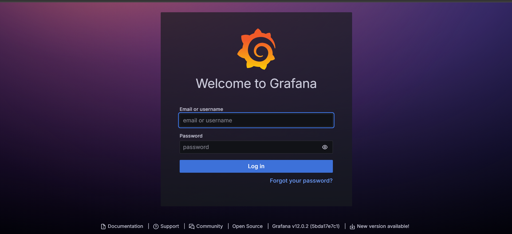
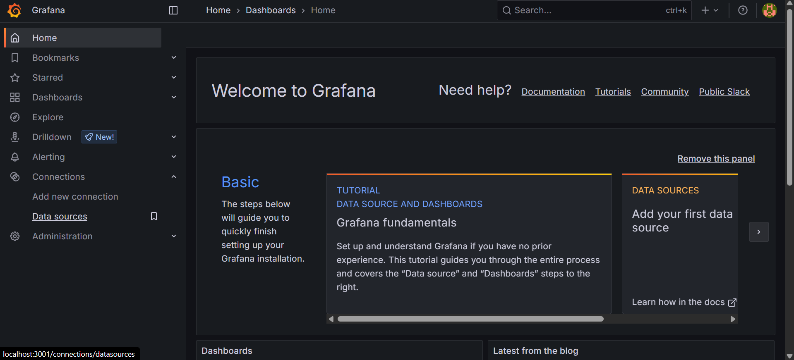
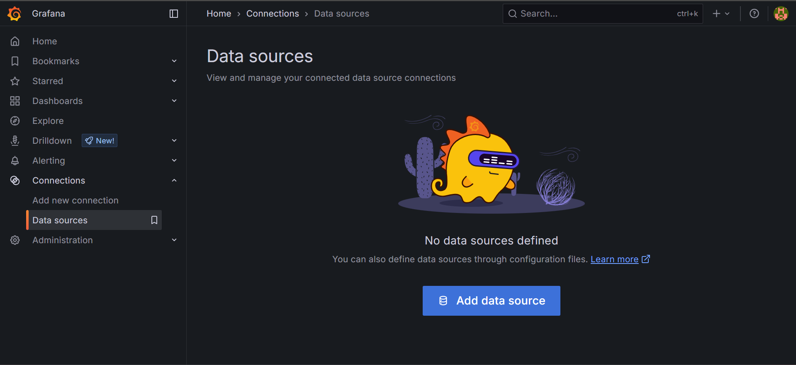
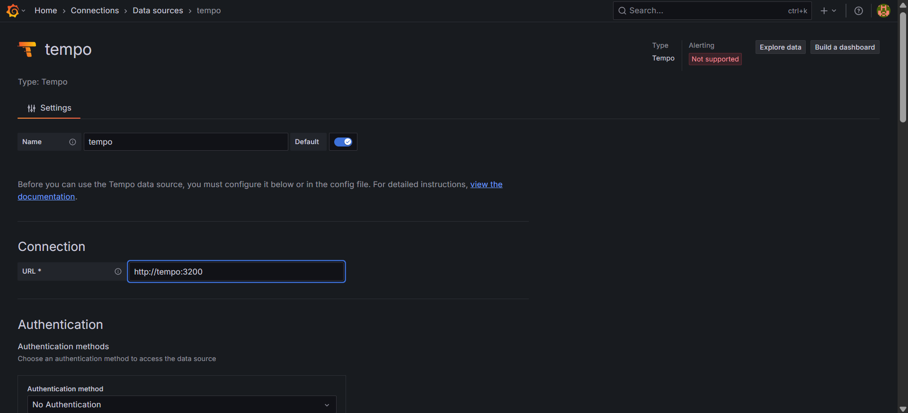
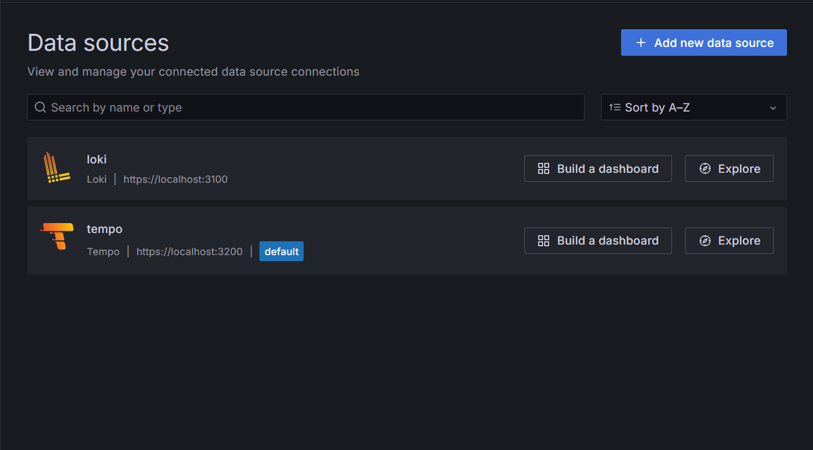
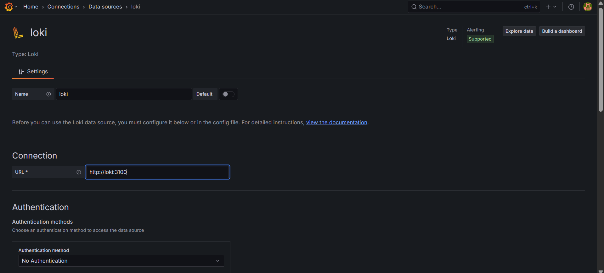
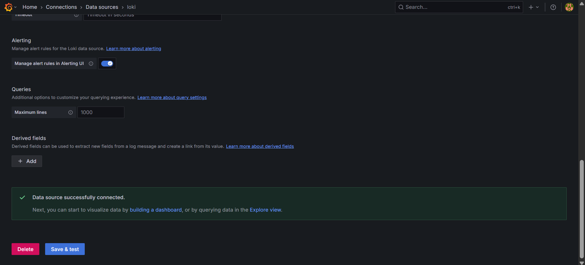
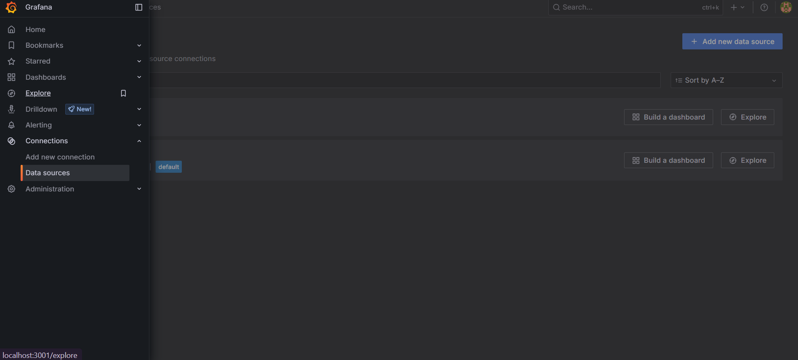
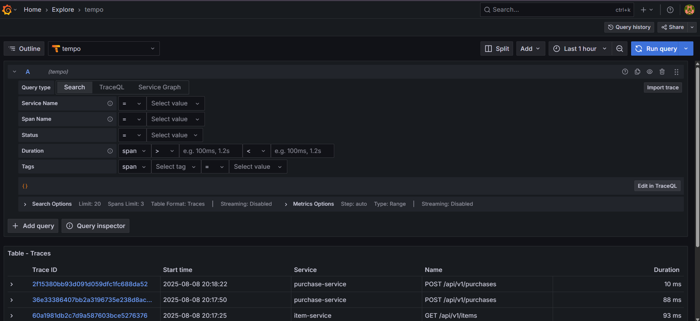
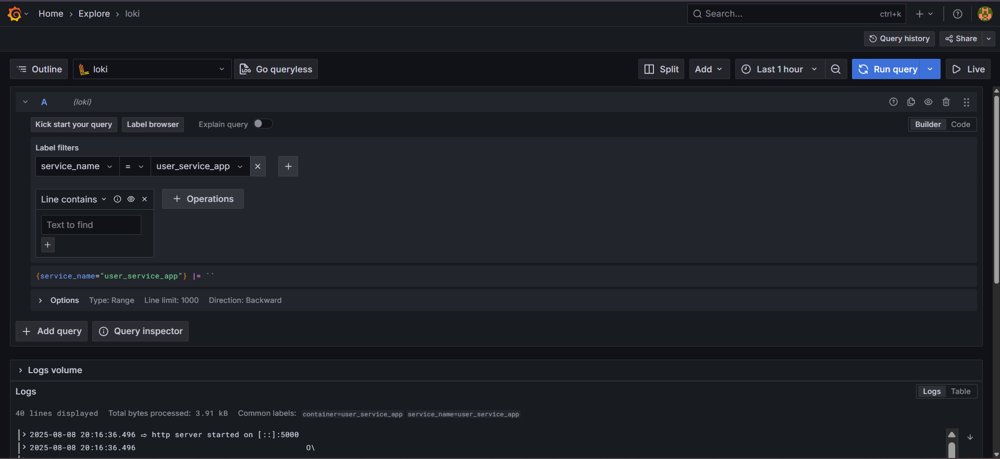

# Observability Integration with Grafana for shop-crud Project

This document provides a comprehensive guide for the `shop-crud` project. It demonstrates how to integrate an observability stack using Grafana for visualization, Grafana Tempo for distributed tracing, and Grafana Loki with Promtail for structured logging.

## About Project
### Project Structure

The project follows a clean architecture pattern with clear separation of concerns. Here's the detailed structure:

```
C:.
│   .env.example                    # Example of .env to be used as a template
│   .gitignore                      # Git configuration to exclude files/folders from version control
│   docker-compose-app.yaml        # Compose file for spinning up the entire app (microservices)
│   Dockerfile                     # Dockerfile for building the root service (if applicable)
│   README.md                      # Project documentation
│
├───db
│       init.sql                   # SQL script to initialize shared database structure or schema
│
├───doc
│   └───img                        # Documentation images/screenshots
│
├───item-service                   # Microservice responsible for item-related operations
│   │   .env.item.example          # Example environment variables specific to item service
│   │   docker-compose.yml        # Compose file for running the item service in isolation
│   │   Dockerfile                # Dockerfile to build item service image
│   │   go.mod                    # Go module definition
│   │   go.sum                    # Go dependency checksums
│   │   main.go                   # Entry point of the item service
│   │
│   ├───config
│   │       config.go             # Loads service configurations
│   │       database.go          # Sets up database connection
│   │
│   ├───db
│   │   └───init.sql             # Item service-specific schema init
│   ├───doc                      # Optional documentation folder
│   ├───middleware
│   │       auth.go              # Middleware for authentication (JWT)
│   │
│   ├───modules
│   │   ├───handlers
│   │   │       item_handler.go  # HTTP handlers for item operations
│   │   ├───models
│   │   │       item.go          # Data models for items
│   │   ├───repositories
│   │   │       item_repo.go     # Database operations for items
│   │   └───usecases
│   │           item_usecase.go  # Business logic for items
│   │
│   └───pkg
│       ├───logger
│       │       logger.go        # Logger initialization (zap/logrus/etc.)
│       └───tracing
│               tracing.go       # Tracing setup using OpenTelemetry
│
├───purchase-service              # Microservice responsible for handling purchases
│   │   .env.purchase.example     # Template for env
│   │   docker-compose.yml       # Compose file to run purchase service individually
│   │   Dockerfile               # Dockerfile to build the purchase service
│   │   go.mod                   # Go module definition
│   │   go.sum                   # Go dependency checksums
│   │   main.go                  # Entry point of the purchase service
│   │
│   ├───config
│   │       config.go            # Loads service-specific configurations
│   │       database.go         # Sets up PostgreSQL DB connection
│   │
│   ├───db
│   │       init.sql            # Schema/init SQL for purchase DB
│   │
│   ├───middleware
│   │       auth.go             # JWT auth middleware
│   │
│   ├───modules
│   │   ├───clients
│   │   │       item_client.go  # HTTP client to communicate with item service
│   │   ├───handlers
│   │   │       purchase_handler.go  # Handles incoming purchase HTTP requests
│   │   ├───models
│   │   │       purchase.go     # Purchase data model
│   │   ├───repositories
│   │   │       purchase_repo.go  # DB operations for purchase records
│   │   └───usecases
│   │           purchase_usecase.go  # Business logic for processing purchases
│   │
│   └───pkg
│       ├───logger
│       │       logger.go       # Logger configuration
│       └───tracing
│               tracing.go      # Tracing setup with OpenTelemetry
│
├───tracing-compose               # Observability stack configuration (Grafana, Loki, Tempo, Promtail)
│       docker-compose-grafana.yaml    # Compose file to run Grafana
│       docker-compose-loki.yaml       # Loki log aggregation setup
│       docker-compose-promtail.yaml   # Promtail for collecting and shipping logs to Loki
│       docker-compose-tempo.yaml      # Tempo for tracing
│       docker-compose-trgrafana.yaml  # Grafana dashboards with tracing config
│       loki-config.yaml               # Loki configuration file
│       promtail-config.yaml           # Promtail configuration file
│       tempo.yaml                     # Tempo configuration
│
└───user-service                  # Microservice responsible for user registration and authentication
    │   .env.user.example         # Example .env
    │   docker-compose.yaml       # Compose file for user service
    │   Dockerfile                # Dockerfile for user service image
    │   go.mod                    # Go module file
    │   go.sum                    # Dependency checksum
    │   main.go                   # Application entry point
    │
    ├───config
    │       config.go             # Configuration loader
    │       database.go           # Database connection
    │
    ├───docs
    │       api.md                # API documentation for user service
    │
    ├───module
    │   ├───handlers
    │   │       user_handler.go   # Handles user registration/login HTTP endpoints
    │   ├───models
    │   │       user.go           # User data model
    │   ├───repositories
    │   │       user_repo.go      # DB logic related to users
    │   └───usecases
    │           user_usecase.go   # Business logic for user-related actions
    │
    └───pkg
        ├───logger
        │       logger.go         # Logging configuration
        └───tracing
                tracing.go        # Tracing configuration

```

### Architecture Overview

Each microservice follows the **Clean Architecture** pattern with the following layers:

1. **Handlers Layer** (`handlers/`): HTTP request/response handling, input validation, and routing
2. **Use Cases Layer** (`usecases/`): Business logic and orchestration
3. **Repository Layer** (`repositories/`): Data access and persistence
4. **Models Layer** (`models/`): Data structures, DTOs, and domain entities

### Key Features

- **Microservices Architecture**: Independent, loosely-coupled services
- **Clean Architecture**: Separation of concerns with clear layer boundaries
- **JWT Authentication**: Secure token-based authentication system
- **Database Integration**: PostgreSQL with proper connection pooling
- **Docker Support**: Containerized deployment with Docker Compose
- **Observability Ready**: OpenTelemetry tracing integration
- **Input Validation**: Request validation using struct tags
- **Error Handling**: Proper HTTP status codes and error responses

## API Documentation

This section provides comprehensive documentation for all available API endpoints across the three microservices.

### Authentication

Most endpoints require JWT authentication. Include the token in the Authorization header:
```
Authorization: Bearer <your_jwt_token>
```

### User Service API

The User Service handles user registration, authentication, and user management.

**Base URL**: `http://localhost:8081/api/v1`

#### POST /users/register
Register a new user account.

**Request Body:**
```json
{
  "name": "John Doe",
  "email": "john@example.com",
  "password": "securepassword123"
}
```

**Validation Rules:**
- `name`: Required
- `email`: Required, must be valid email format
- `password`: Required, minimum 8 characters

**Responses:**
- `201 Created`: User successfully registered
```json
{
  "id": "550e8400-e29b-41d4-a716-446655440000",
  "name": "John Doe",
  "email": "john@example.com",
  "created_at": "2025-01-01T10:00:00Z",
  "updated_at": "2025-01-01T10:00:00Z"
}
```

- `400 Bad Request`: Validation error
- `409 Conflict`: Email already exists
- `500 Internal Server Error`: Server error

#### POST /users/login
Authenticate user and get access token.

**Request Body:**
```json
{
  "email": "john@example.com",
  "password": "securepassword123"
}
```

**Responses:**
- `200 OK`: Login successful
```json
{
  "access_token": "eyJhbGciOiJIUzI1NiIsInR5cCI6IkpXVCJ9..."
}
```

- `400 Bad Request`: Validation error
- `401 Unauthorized`: Invalid credentials
- `500 Internal Server Error`: Server error

### Item Service API

The Item Service manages product/item data with full CRUD operations.

**Base URL**: `http://localhost:8082/api/v1`

#### GET /items
Get all items (public endpoint).

**Query Parameters:**
- `limit` (optional): Number of items per page
- `offset` (optional): Number of items to skip

**Responses:**
- `200 OK`: List of items
```json
[
  {
    "id": "550e8400-e29b-41d4-a716-446655440001",
    "name": "Laptop Gaming",
    "description": "High-performance gaming laptop",
    "price": 1500.00,
    "stock": 10,
    "created_at": "2025-01-01T10:00:00Z",
    "updated_at": "2025-01-01T10:00:00Z"
  }
]
```

#### GET /items/:id
Get item by ID (public endpoint).

**Path Parameters:**
- `id`: Item UUID

**Responses:**
- `200 OK`: Item details
```json
{
  "id": "550e8400-e29b-41d4-a716-446655440001",
  "name": "Laptop Gaming",
  "description": "High-performance gaming laptop",
  "price": 1500.00,
  "stock": 10,
  "created_at": "2025-01-01T10:00:00Z",
  "updated_at": "2025-01-01T10:00:00Z"
}
```

- `400 Bad Request`: Invalid item ID format
- `404 Not Found`: Item not found
- `500 Internal Server Error`: Server error

#### POST /items
Create a new item (requires authentication).

**Request Body:**
```json
{
  "name": "Laptop Gaming",
  "description": "High-performance gaming laptop",
  "price": 1500.00,
  "stock": 10
}
```

**Validation Rules:**
- `name`: Required, minimum 3 characters
- `description`: Optional
- `price`: Required, must be >= 0
- `stock`: Required, must be >= 0

**Responses:**
- `201 Created`: Item successfully created
- `400 Bad Request`: Validation error
- `401 Unauthorized`: Missing or invalid token
- `500 Internal Server Error`: Server error

#### PUT /items/:id
Update an existing item (requires authentication).

**Path Parameters:**
- `id`: Item UUID

**Request Body:**
```json
{
  "name": "Updated Laptop Gaming",
  "description": "Updated high-performance gaming laptop",
  "price": 1600.00,
  "stock": 8
}
```

**Responses:**
- `200 OK`: Item successfully updated
- `400 Bad Request`: Validation error or invalid ID format
- `401 Unauthorized`: Missing or invalid token
- `404 Not Found`: Item not found
- `500 Internal Server Error`: Server error

#### DELETE /items/:id
Delete an item (requires authentication).

**Path Parameters:**
- `id`: Item UUID

**Responses:**
- `204 No Content`: Item successfully deleted
- `400 Bad Request`: Invalid item ID format
- `401 Unauthorized`: Missing or invalid token
- `404 Not Found`: Item not found
- `500 Internal Server Error`: Server error

### Purchase Service API

The Purchase Service handles transaction creation and management.

**Base URL**: `http://localhost:8083/api/v1`

#### POST /purchases
Create a new purchase (requires authentication).

**Request Body:**
```json
{
  "items": [
    {
      "item_id": "550e8400-e29b-41d4-a716-446655440001",
      "quantity": 2
    },
    {
      "item_id": "550e8400-e29b-41d4-a716-446655440002",
      "quantity": 1
    }
  ]
}
```

**Validation Rules:**
- `items`: Required, must have at least 1 item
- `item_id`: Required, must be valid UUID
- `quantity`: Required, must be > 0

**Responses:**
- `201 Created`: Purchase successfully created
```json
{
  "id": "550e8400-e29b-41d4-a716-446655440003",
  "user_id": "550e8400-e29b-41d4-a716-446655440000",
  "total_amount": 3100.00,
  "created_at": "2025-01-01T10:00:00Z",
  "items": [
    {
      "item_id": "550e8400-e29b-41d4-a716-446655440001",
      "quantity": 2,
      "name": "Laptop Gaming",
      "price": 1500.00
    },
    {
      "item_id": "550e8400-e29b-41d4-a716-446655440002",
      "quantity": 1,
      "name": "Mouse Gaming",
      "price": 100.00
    }
  ]
}
```

- `400 Bad Request`: Validation error
- `401 Unauthorized`: Missing or invalid token
- `409 Conflict`: Item not found or insufficient stock
- `500 Internal Server Error`: Server error

#### GET /purchases
Get user's purchase history (requires authentication).

**Responses:**
- `200 OK`: Successfully retrieved purchase history
```json
[
  {
    "id": "550e8400-e29b-41d4-a716-446655440003",
    "user_id": "550e8400-e29b-41d4-a716-446655440000",
    "total_amount": 3100.00,
    "created_at": "2025-01-01T10:00:00Z",
    "items": [
      {
        "item_id": "550e8400-e29b-41d4-a716-446655440001",
        "quantity": 2,
        "name": "Laptop Gaming",
        "price": 1500.00
      }
    ]
  }
]
```

### Error Response Format

All endpoints return errors in a consistent format:

```json
{
  "error": "Descriptive error message"
}
```

### HTTP Status Codes

- `200 OK`: Request successful
- `201 Created`: Resource created successfully
- `204 No Content`: Resource deleted successfully
- `400 Bad Request`: Invalid request data
- `401 Unauthorized`: Authentication required or invalid
- `404 Not Found`: Resource not found
- `409 Conflict`: Resource conflict (e.g., email already exists)
- `500 Internal Server Error`: Server error

### Service Ports

- **User Service**: `5000`
- **Item Service**: `5001`
- **Purchase Service**: `5002`
- **Grafana**: `3001`
- **Tempo**: `3200`
- **Loki**: `3100`

## Example Tracing and Logging in a Go Handler


```go
func (h *UserHandler) Register(c echo.Context) error {
   var req models.RegisterRequest
   // start tracing span for RegisterHandler
   tracer := otel.Tracer("user-service-handler")
   ctx, span := tracer.Start(c.Request().Context(), "RegisterHandler")
   defer span.End()
   // set route and email attributes after binding
	
	// 1. Binding request body ke struct.
   if err := c.Bind(&req); err != nil {
		logger.Error(ctx, "Failed to bind register request: "+err.Error())
		return c.JSON(http.StatusBadRequest, map[string]string{"error": "Invalid request body"})
	}
   // annotate span with attributes
   span.SetAttributes(
       attribute.String("http.route", c.Path()),
       attribute.String("user.email", req.Email),
   )
	if err := c.Validate(&req); err != nil {
		logger.Error(ctx, "Validation failed on register: "+err.Error())
		return c.JSON(http.StatusBadRequest, map[string]string{"error": err.Error()})
	}
	logger.Info(ctx, "Attempting to register user: "+req.Email)
   user, err := h.userUsecase.Register(ctx, req)
	if err != nil {
		if errors.Is(err, usecases.ErrEmailExists) {
			logger.Warn(ctx, "Registration failed, email already exists: "+req.Email)
			return c.JSON(http.StatusConflict, map[string]string{"error": err.Error()}) // 409 Conflict
		}
		logger.Error(ctx, "Internal server error on register: "+err.Error())
		return c.JSON(http.StatusInternalServerError, map[string]string{"error": "Failed to register user"})
	}
	logger.Info(ctx, "✅ Register user success: "+user.Email)
	return c.JSON(http.StatusCreated, user) // 201 Created
}
```

## See tracing and log
### Step 1: Open grafana 
Open your web browser and access the Grafana dashboard at the following address:
http://localhost:5080

Log in using the default credentials



### Step 2: Add data source for Tempo
1. In the left menu, go to Administration > Data sources.

2. Click "Add new data source".

3. Search for and select Tempo.
4. In the settings page, under Connection, set the URL to:
http://tempo:3200

5. Scroll down and click "Save & test". You should see a "Data source is working" message


### Step 3: Add data source for Loki
1. Click "Add new data source".
2. Search for and select Loki.
3. In the settings page, under Connection, set the URL to:
http://loki:3100

4. Scroll down and click "Save & test". You should see a "Data source is working" message


### Step 4: View Traces and Logs
1. In the left menu, click the compass icon (🧭 Explore).

2. Select the Tempo data source from the dropdown at the top.
3. Click on any trace in the list to open the flame graph.

4. Click on a specific span within the trace.


To view logs you can switch to Loki data source and explore the logs.
