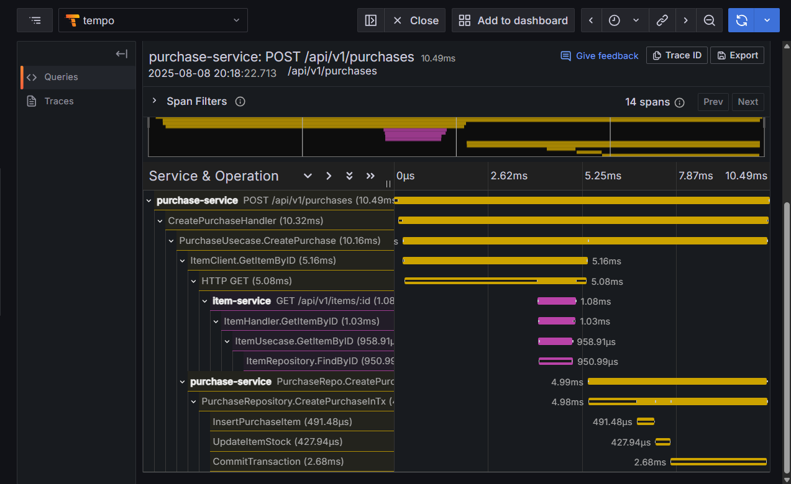

# Observability Integration with Codex CLI and OpenObserve for shop-crud Project

This document will guide you through installing the Codex CLI, provide a brief overview of the `shop-crud` project, and demonstrate how to use Codex to add observability functionality using OpenObserve.

## A. Codex CLI Installation and Configuration

This section covers all the necessary steps to install and set up Codex in your local environment.

### 1. Install Codex via NPM

```bash
npm install -g @openai/codex@latest
```
### 2. Create the Configuration File

Create the configuration directory and file by running the following command:

```bash
mkdir -p ~/.codex && cat > ~/.codex/config.json <<'EOF'
{
  "providers": {
    "azure": {
      "name": "AzureOpenAI",
      "baseURL": "https://dpe-open-ai.openai.azure.com/openai",
      "envKey": "AZURE_OPENAI_API_KEY"
    }
  },
  "provider": "azure",
  "model": "o4-mini"
}
```

### 3. Set Up Environment Variables

Add your API key as environment variables. Codex will use these for authentication.

Replace `(your_provided_key)` with your actual API key:

```bash
export AZURE_OPENAI_API_KEY="(your_provided_key)"
export OPENAI_API_KEY="(your_provided_key)"
```

### 4. Run the Codex CLI

Verify your installation by running the following command.  
The `--auto-edit` flag allows Codex to modify your files directly:

```bash
codex -p azure --auto-edit
```
## B. Introduction to the shop-crud Project

`shop-crud` is a Go-based application designed with a microservices architecture. Its purpose is to provide basic CRUD (Create, Read, Update, Delete) functionality for an e-commerce system.

The project is composed of several independent services:

- **User Service**: Manages user data, registration, and authentication.
- **Item Service**: Manages product or item data.
- **Purchase Service**: Manages purchase transactions.

### Project Structure

The project follows a clean architecture pattern with clear separation of concerns. Here's the detailed structure:

```
codex-apm-o2-local/
├── docker-compose.yaml          # Main Docker Compose file for all services
├── Dockerfile                   # Base Dockerfile
├── README.md                    # This documentation
├── db/
│   └── init.sql                # Database initialization script
│
├── user-service/               # User management microservice
│   ├── docker-compose.yaml    # Service-specific Docker Compose
│   ├── Dockerfile              # Service-specific Dockerfile
│   ├── go.mod                  # Go module dependencies
│   ├── go.sum                  # Go module checksums
│   ├── main.go                 # Service entry point
│   ├── config/
│   │   ├── config.go          # Configuration management
│   │   └── database.go        # Database connection setup
│   ├── docs/
│   │   └── api.md             # API documentation
│   ├── module/
│   │   ├── handlers/          # HTTP request handlers
│   │   │   └── user_handler.go
│   │   ├── models/            # Data models and DTOs
│   │   │   └── user.go
│   │   ├── repositories/      # Data access layer
│   │   │   └── user_repo.go
│   │   └── usecases/          # Business logic layer
│   │       └── user_usecase.go
│   └── pkg/
│       └── tracing/           # OpenTelemetry tracing setup
│           └── tracing.go
│
├── item-service/               # Item/Product management microservice
│   ├── docker-compose.yml     # Service-specific Docker Compose
│   ├── Dockerfile              # Service-specific Dockerfile
│   ├── go.mod                  # Go module dependencies
│   ├── go.sum                  # Go module checksums
│   ├── main.go                 # Service entry point
│   ├── config/
│   │   ├── config.go          # Configuration management
│   │   └── database.go        # Database connection setup
│   ├── middleware/
│   │   └── auth.go            # Authentication middleware
│   ├── modules/
│   │   ├── handlers/          # HTTP request handlers
│   │   │   └── item_handler.go
│   │   ├── models/            # Data models and DTOs
│   │   │   └── item.go
│   │   ├── repositories/      # Data access layer
│   │   │   └── item_repo.go
│   │   └── usecases/          # Business logic layer
│   │       └── item_usecase.go
│   └── tracing/               # OpenTelemetry tracing setup
│       └── tracing.go
│
└── purchase-service/           # Purchase/Transaction management microservice
    ├── docker-compose.yml     # Service-specific Docker Compose
    ├── Dockerfile              # Service-specific Dockerfile
    ├── go.mod                  # Go module dependencies
    ├── go.sum                  # Go module checksums
    ├── main.go                 # Service entry point
    ├── config/
    │   ├── config.go          # Configuration management
    │   └── database.go        # Database connection setup
    ├── db/
    │   └── init.sql           # Service-specific database initialization
    ├── middleware/
    │   └── auth.go            # Authentication middleware
    ├── modules/
    │   ├── handlers/          # HTTP request handlers
    │   │   └── purchase_handler.go
    │   ├── models/            # Data models and DTOs
    │   │   └── purchase.go
    │   ├── repositories/      # Data access layer
    │   │   └── purchase_repo.go
    │   └── usecases/          # Business logic layer
    │       └── purchase_usecase.go
    └── pkg/
        └── tracing/           # OpenTelemetry tracing setup
            └── tracing.go
```

### Architecture Overview

Each microservice follows the **Clean Architecture** pattern with the following layers:

1. **Handlers Layer** (`handlers/`): HTTP request/response handling, input validation, and routing
2. **Use Cases Layer** (`usecases/`): Business logic and orchestration
3. **Repository Layer** (`repositories/`): Data access and persistence
4. **Models Layer** (`models/`): Data structures, DTOs, and domain entities

### Key Features

- **Microservices Architecture**: Independent, loosely-coupled services
- **Clean Architecture**: Separation of concerns with clear layer boundaries
- **JWT Authentication**: Secure token-based authentication system
- **Database Integration**: PostgreSQL with proper connection pooling
- **Docker Support**: Containerized deployment with Docker Compose
- **Observability Ready**: OpenTelemetry tracing integration
- **Input Validation**: Request validation using struct tags
- **Error Handling**: Proper HTTP status codes and error responses

## D. API Documentation

This section provides comprehensive documentation for all available API endpoints across the three microservices.

### Authentication

Most endpoints require JWT authentication. Include the token in the Authorization header:
```
Authorization: Bearer <your_jwt_token>
```

### User Service API

The User Service handles user registration, authentication, and user management.

**Base URL**: `http://localhost:8081/api/v1`

#### POST /users/register
Register a new user account.

**Request Body:**
```json
{
  "name": "John Doe",
  "email": "john@example.com",
  "password": "securepassword123"
}
```

**Validation Rules:**
- `name`: Required
- `email`: Required, must be valid email format
- `password`: Required, minimum 8 characters

**Responses:**
- `201 Created`: User successfully registered
```json
{
  "id": "550e8400-e29b-41d4-a716-446655440000",
  "name": "John Doe",
  "email": "john@example.com",
  "created_at": "2025-01-01T10:00:00Z",
  "updated_at": "2025-01-01T10:00:00Z"
}
```

- `400 Bad Request`: Validation error
- `409 Conflict`: Email already exists
- `500 Internal Server Error`: Server error

#### POST /users/login
Authenticate user and get access token.

**Request Body:**
```json
{
  "email": "john@example.com",
  "password": "securepassword123"
}
```

**Responses:**
- `200 OK`: Login successful
```json
{
  "access_token": "eyJhbGciOiJIUzI1NiIsInR5cCI6IkpXVCJ9..."
}
```

- `400 Bad Request`: Validation error
- `401 Unauthorized`: Invalid credentials
- `500 Internal Server Error`: Server error

### Item Service API

The Item Service manages product/item data with full CRUD operations.

**Base URL**: `http://localhost:8082/api/v1`

#### GET /items
Get all items (public endpoint).

**Query Parameters:**
- `limit` (optional): Number of items per page
- `offset` (optional): Number of items to skip

**Responses:**
- `200 OK`: List of items
```json
[
  {
    "id": "550e8400-e29b-41d4-a716-446655440001",
    "name": "Laptop Gaming",
    "description": "High-performance gaming laptop",
    "price": 1500.00,
    "stock": 10,
    "created_at": "2025-01-01T10:00:00Z",
    "updated_at": "2025-01-01T10:00:00Z"
  }
]
```

#### GET /items/:id
Get item by ID (public endpoint).

**Path Parameters:**
- `id`: Item UUID

**Responses:**
- `200 OK`: Item details
```json
{
  "id": "550e8400-e29b-41d4-a716-446655440001",
  "name": "Laptop Gaming",
  "description": "High-performance gaming laptop",
  "price": 1500.00,
  "stock": 10,
  "created_at": "2025-01-01T10:00:00Z",
  "updated_at": "2025-01-01T10:00:00Z"
}
```

- `400 Bad Request`: Invalid item ID format
- `404 Not Found`: Item not found
- `500 Internal Server Error`: Server error

#### POST /items
Create a new item (requires authentication).

**Request Body:**
```json
{
  "name": "Laptop Gaming",
  "description": "High-performance gaming laptop",
  "price": 1500.00,
  "stock": 10
}
```

**Validation Rules:**
- `name`: Required, minimum 3 characters
- `description`: Optional
- `price`: Required, must be >= 0
- `stock`: Required, must be >= 0

**Responses:**
- `201 Created`: Item successfully created
- `400 Bad Request`: Validation error
- `401 Unauthorized`: Missing or invalid token
- `500 Internal Server Error`: Server error

#### PUT /items/:id
Update an existing item (requires authentication).

**Path Parameters:**
- `id`: Item UUID

**Request Body:**
```json
{
  "name": "Updated Laptop Gaming",
  "description": "Updated high-performance gaming laptop",
  "price": 1600.00,
  "stock": 8
}
```

**Responses:**
- `200 OK`: Item successfully updated
- `400 Bad Request`: Validation error or invalid ID format
- `401 Unauthorized`: Missing or invalid token
- `404 Not Found`: Item not found
- `500 Internal Server Error`: Server error

#### DELETE /items/:id
Delete an item (requires authentication).

**Path Parameters:**
- `id`: Item UUID

**Responses:**
- `204 No Content`: Item successfully deleted
- `400 Bad Request`: Invalid item ID format
- `401 Unauthorized`: Missing or invalid token
- `404 Not Found`: Item not found
- `500 Internal Server Error`: Server error

### Purchase Service API

The Purchase Service handles transaction creation and management.

**Base URL**: `http://localhost:8083/api/v1`

#### POST /purchases
Create a new purchase (requires authentication).

**Request Body:**
```json
{
  "items": [
    {
      "item_id": "550e8400-e29b-41d4-a716-446655440001",
      "quantity": 2
    },
    {
      "item_id": "550e8400-e29b-41d4-a716-446655440002",
      "quantity": 1
    }
  ]
}
```

**Validation Rules:**
- `items`: Required, must have at least 1 item
- `item_id`: Required, must be valid UUID
- `quantity`: Required, must be > 0

**Responses:**
- `201 Created`: Purchase successfully created
```json
{
  "id": "550e8400-e29b-41d4-a716-446655440003",
  "user_id": "550e8400-e29b-41d4-a716-446655440000",
  "total_amount": 3100.00,
  "created_at": "2025-01-01T10:00:00Z",
  "items": [
    {
      "item_id": "550e8400-e29b-41d4-a716-446655440001",
      "quantity": 2,
      "name": "Laptop Gaming",
      "price": 1500.00
    },
    {
      "item_id": "550e8400-e29b-41d4-a716-446655440002",
      "quantity": 1,
      "name": "Mouse Gaming",
      "price": 100.00
    }
  ]
}
```

- `400 Bad Request`: Validation error
- `401 Unauthorized`: Missing or invalid token
- `409 Conflict`: Item not found or insufficient stock
- `500 Internal Server Error`: Server error

### Error Response Format

All endpoints return errors in a consistent format:

```json
{
  "error": "Descriptive error message"
}
```

### HTTP Status Codes

- `200 OK`: Request successful
- `201 Created`: Resource created successfully
- `204 No Content`: Resource deleted successfully
- `400 Bad Request`: Invalid request data
- `401 Unauthorized`: Authentication required or invalid
- `404 Not Found`: Resource not found
- `409 Conflict`: Resource conflict (e.g., email already exists)
- `500 Internal Server Error`: Server error

### Service Ports

- **User Service**: `8081`
- **Item Service**: `8082`
- **Purchase Service**: `8083`
- **OpenObserve UI**: `5080`
- **OpenObserve Logs**: `5081`
- **OpenObserve Metrics**: `5082`
- **OpenObserve OTLP Traces**: `5083`

### Main Objective of this Tutorial

The goal of this guide is to demonstrate how the Codex CLI can be used as an AI assistant to automatically add observability features to the `shop-crud` project, using **OpenObserve** as the backend for logs, metrics, and distributed tracing.

## C. Using Codex to Add OpenObserve

Here are example prompts we will use to ask Codex to modify our project and integrate OpenObserve.

---

### 🧠 Prompt 1: Add the OpenObserve Service to Docker Compose

**Prompt Goal:**  
To ask Codex to add the OpenObserve service definition to the main `docker-compose.yaml` file.

**The Prompt:**

Add OpenObserve to my existing Docker Compose file using the latest image, with the service name openobserve. The UI should be on port 5080, logs on 5081, metrics on 5082, and OTLP traces on 5083. Set a root email and password for the dashboard UI. Include restart: unless-stopped, and add a volume that maps ./openobserve_data to /app/data. Do not include any depends_on configuration.


**Expected Outcome:**

- **File to be Modified:** `docker-compose.yaml`  
- **Location:** Root directory of your project  
- **Changes:** Codex will add a new service named `openobserve` to the Docker Compose file with:
  - UI on port `5080`
  - Logs on port `5081`
  - Metrics on port `5082`
  - Traces via OTLP on port `5083`
  - Volume mount: `./openobserve_data:/app/data`
  - Environment variables: root email & password for dashboard
  - `restart: unless-stopped` policy

---

### 🧠 Prompt 2: Create the Tracing Configuration File

**Prompt Goal:**  
To ask Codex to create a new Go file that initializes OpenTelemetry and sends traces to OpenObserve.

**The Prompt:**

Create a file at internal/tracing/tracing.go that contains a function InitTracerProvider(serviceName, collectorHost string) to initialize OpenTelemetry tracing using an OTLP HTTP exporter. The exporter should send traces to /api/default/v1/traces and include an Authorization header using basic auth read from the environment variable OTEL_AUTH_TOKEN, with a default fallback if the variable is not set. Add resource attributes for the service name and environment=development, and use AlwaysSample for sampling. Also include a helper function getEnvOrDefault(key, fallback) to handle the environment variable with fallback logic.

**Expected Outcome:**

- **File to be Created:** `internal/tracing/tracing.go`  
- **Location:** Inside each microservice folder that will use tracing (e.g., `user-service/pkg/tracing/`, `item-service/pkg/tracing/`, etc.)

**File Contents Will Include:**

- ✅ A function: `InitTracerProvider(serviceName, collectorHost string)`
- ✅ A helper: `getEnvOrDefault(key, fallback string)`
- ✅ Full configuration to:
  - Use OTLP HTTP exporter
  - Send data to `/api/default/v1/traces`
  - Attach Authorization header using `ZO_ROOT_USER_TOKEN` or fallback
  - Include resource attributes like `service.name` and `environment=development`
  - Use `AlwaysSample` to sample all traces

### 🧠 Prompt 3: Add Tracing to The Main Function

**Prompt Goal:**  
Initialize the tracer provider in the main service entry point.

**The Prompt:**
Add tracing initialization to the main function in user-service's main.go using InitTracerProvider("user-service", "openobserve:5080"). If there's an error, log.Fatal it. Also add a deferred shutdown call with context.Background() and log error if it fails.

**Expected Outcome:**

```go
tp, err := tracing.InitTracerProvider("user-service", "openobserve:5080")
if err != nil {
	log.Fatalf("❌ Failed to initialize tracer: %v", err)
}
defer func() {
	if err := tp.Shutdown(context.Background()); err != nil {
		log.Printf("❌ Error shutting down tracer: %v", err)
	}
}()
```
### 🧠 Prompt 4: Add Tracing to RegisterHandler (User Handler)

**Prompt Goal:**  
To instrument the `RegisterHandler` in `user-service`.

**The Prompt:**
Add OpenTelemetry tracing to RegisterHandler in user-service modules. The handler is in user-service/bin/modules/handlers/user_handler.go. Use otel.Tracer("user-service-handler"), name the span "RegisterHandler", set attributes http.route and user.email.

**Expected Outcome:**

```go
ctx := c.Request().Context()
tr := otel.Tracer("user-service-handler")
ctx, span := tr.Start(ctx, "RegisterHandler")
defer span.End()

span.SetAttributes(
	attribute.String("http.route", "/users/register"),
	attribute.String("user.email", req.Email),
)
```

### 🧠 Prompt 5: Add Tracing to Register Usecase

**Prompt Goal:**  
Instrument the core business logic for user registration

**The Prompt:**
Add OpenTelemetry tracing to the Register function in user_usecase.go in user-service. Use otel.Tracer("user-service-usecase"), span name "UserUsecase.Register", and set user.email and user.name as span attributes from the request.

**Expected Outcome:**

```go
tr := otel.Tracer("user-service-usecase")
ctx, span := tr.Start(ctx, "UserUsecase.Register")
defer span.End()

span.SetAttributes(
	attribute.String("user.email", req.Email),
	attribute.String("user.name", req.Name),
)
```
### 🧠 Prompt 6: Add Tracing to Repository Layer (UserRepository.Create)

**Prompt Goal:**  
Trace database interaction at the repository level in the `user-service`.

**The Prompt:**
Add OpenTelemetry tracing to the Create method in user_repo.go of user-service. Use otel.Tracer("user-service-repo"), span name "UserRepository.Create", and add attributes user.id and user.email.

**Expected Outcome:**

```go
tr := otel.Tracer("user-service-repo")
ctx, span := tr.Start(ctx, "UserRepository.Create")
defer span.End()

span.SetAttributes(
	attribute.String("user.id", user.ID.String()),
	attribute.String("user.email", user.Email),
)
```

## 🧪 Tracing Setup and Test Instructions

Follow these steps to start OpenObserve, configure authentication, and run the user service to test tracing.

---

### 🔧 Step 1: Start OpenObserve

Run the following command to build and start the OpenObserve service:

```bash
docker compose up openobserve --build
```
### 🌐 Step 2: Open the Dashboard

Once OpenObserve is running, open your browser and navigate to:

http://localhost:5080

### 🔐 Step 3: Generate `ZO_ROOT_USER_TOKEN`

Instead of manually copying a Basic token, now you can generate the required `ZO_ROOT_USER_TOKEN` by base64-encoding your root email and password.

---

#### 💻 Command Example (Linux/macOS/WSL):

```bash
echo -n 'your_email@example.com:your_password' | base64
```

### 📝 Step 4: Update Your `.env` File

Copy only the encoded value and add it to your `.env` file:

```env
ZO_ROOT_USER_TOKEN=YWRtaW5AZ21haWwuY29tOlE3U21YNmJ2ZXRiY1V4Y0E=
```


### 🚀 Step 5: Start User Service and Database

Open a **new terminal** and run the following command to start both the user service and PostgreSQL database:

```bash
docker compose up user-service db --build
```
### 🚀 Test the Register Endpoint

**URL:**

http://localhost:{{USER_SERVICE_PORT}}/api/v1/users/register

***Request Payload (JSON):***
```json
{
  "name": "example",
  "email": "example@gmail.com",
  "password": "example123"
}
```
If tracing has been configured correctly, you should see a new trace appear in the OpenObserve dashboard at http://localhost:5080

#### 📸 Sample Payload Sent


---

#### 📊 Trace Appears in OpenObserve



---

#### 🔍 Detailed Trace Layer View

